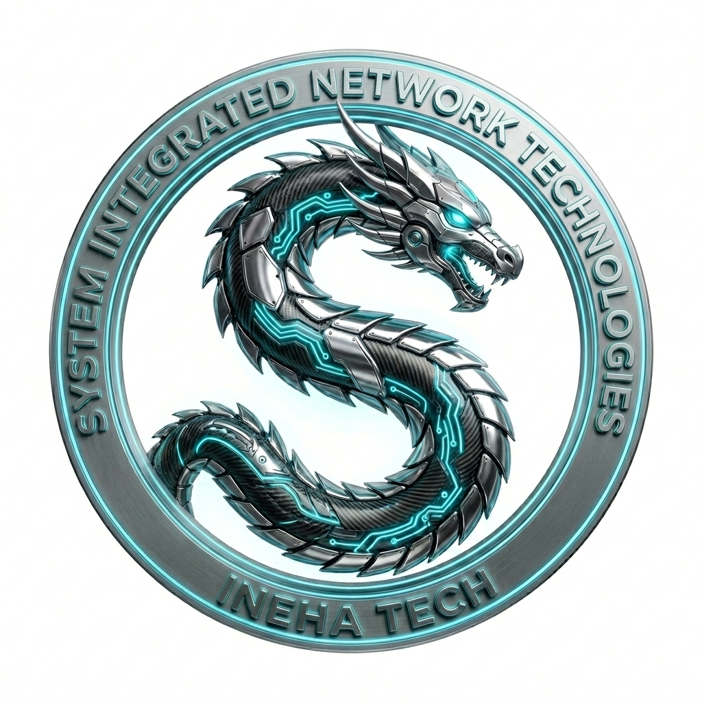

<p align="center">
  
</p>

<h1 align="center">TeamBrain</h1>

<p align="center">
  <strong>Permission-aware AI knowledge copilot for small professional-services firms</strong><br/>
  Law firms · accounting firms · agencies · clinics — 5–50 people
</p>

<p align="center">
  
  
  
  
  
</p>

---

TeamBrain turns a firm's scattered internal documents into a conversational search
assistant that answers questions **with inline citations** linking to the exact source
paragraph — and **never shows anyone a document they aren't allowed to see**.

Ask *"What's the escrow arrangement on the Acme acquisition?"* and get a two-line answer
with `[1] [2]` citation chips you can click to open the source file, instead of digging
through folders for twenty minutes. The #1 correctness rule: **every retrieved chunk is
filtered by the requesting user's actual Drive access *before* it is ever scored, and
*before* anything reaches the LLM context.** When retrieval isn't confident, TeamBrain
says *"I couldn't find a confident answer to that"* — it never guesses.

## ✨ MVP features

| | Feature | What it does |
|---|---|---|
| 💬 | **Cited answers** | Natural-language questions in; answers with inline `[n]` citations mapped 1:1 to source chunks, confidence, and latency. Click a chip to open the source drawer. |
| 🔐 | **Permission-aware retrieval** | Chunks from files the requester can't open in Drive are removed **before scoring and before the LLM context**. The UI transparently reports *"N potentially relevant chunks are restricted"*. Ambiguous cases under-surface, never over-surface. |
| 🔌 | **Google Drive connector** | OAuth-style connect flow (account → consent → live indexing progress) plus manual document upload with per-file visibility (`Just me` / `Everyone`). |
| 🔄 | **Re-indexing** | Background scheduler auto re-indexes stale sources, plus a manual **Re-sync now** button with live progress polling. |
| 🙅 | **Abstention over hallucination** | A confidence gate (hybrid retrieval score) runs *before* the LLM is called; a post-check runs after. Low confidence ⇒ the fallback answer, never a fabricated citation. |
| 📊 | **Admin insights** | KPI cards, top queries, **documentation gaps** (distinguishing *permission-filtered misses* from *true document gaps* — a goldmine for spotting what your firm should write down), team usage, and sync history. |

## 🎮 The money demo (60 seconds)

The seeded workspace is **Whitfield & Associates LLP**, a 12-person boutique law firm.
Log in with any of these accounts (email only, no password in the demo):

| Account | Person | Access |
|---|---|---|
| `alice@whitfield.legal` | Alice Whitfield — Managing Partner (admin) | Sees everything, incl. partner-privileged Acme files |
| `bob@whitfield.legal` | Bob Alvarez — Senior Associate | Firm-wide files; *not* Johnson/Meridian restricted matters |
| `carol@whitfield.legal` | Carol Nguyen — Paralegal, week 2 | Firm-wide policies only; restricted files invisible |

1. **Log in as Alice** → click the suggestion *"Acme purchase price & escrow"* →
   a confident answer with `[1] [2]` citation chips → click a chip to open the
   source drawer with the chunk-by-chunk view and sharing metadata.
2. **Switch teammate to Carol** (header dropdown) → ask the same question →
   *"I couldn't find a confident answer"* plus *"5 potentially relevant chunks are
   restricted to other teammates"*. The restricted content **never reached the LLM**.
3. As Carol, ask an allowed question (e.g. the mileage rate) → normal cited answer.
4. **Sources tab (Alice)** → *Simulate incoming Drive file* → a new policy lands in the
   simulated Drive → re-run the sync → ask the question that previously failed →
   now it's answered from the new document. That's the gap-closing arc.
5. **Insights tab** → documentation gaps with `PERMS` vs `GAP` badges, top queries, KPIs.

## 🏗️ Architecture

```
 Google Drive (OAuth connector)          Manual uploads
        │                                        │
        ▼                                        ▼
 INGESTION — pull → chunk (heading-aware, ~700 chars) → embed (sparse term-vectors)
        │
        ▼
 INDEX — SQLite: files + chunks + embeddings
        │
        │  user asks a question
        ▼
 ┌──────────────────────────────────────────────────────────────┐
 │ PERMISSION FILTER — the #1 correctness requirement            │
 │ remove chunks from files the requester cannot open in Drive  │
 │ (owner / EVERYONE / explicit share), count excluded hits     │
└──────────────────────────────────────────────────────────────┘
        ▼
 HYBRID SCORING — 0.4·TF-IDF cosine + 0.5·BM25 + 0.25·title boost
        ▼
 CONFIDENCE GATE (score ≥ 0.16, top-5 chunks)
        │  below threshold ──► "I couldn't find a confident answer" (LLM skipped)
        ▼
 LLM SYNTHESIS — answer strictly from numbered excerpts, inline [n] citations
```

### Directory layout

```
src/
  app/
    page.tsx                    # single-route app shell (the whole product)
    api/…                       # route handlers (see API surface below)
  components/
    teambrain/                  # login-screen, chat-view, sources-view,
                                # insights-view, oauth-dialog, file-drawer, …
    ui/                         # shadcn/ui primitives
  lib/
    db.ts                       # Prisma client
    teambrain/
      permissions.ts            # userCanAccessFile — the correctness layer
      retrieval.ts              # permission filter → hybrid score → gate
      text.ts                   # tokenizer, stemmer, TF-IDF embeddings, BM25
      chunker.ts                # heading-aware chunking
      llm.ts                    # LLM wrapper (z-ai-web-dev-sdk, backend only)
      sync.ts                   # sync jobs with persisted progress
      scheduler.ts              # background re-index tick
      session.ts                # httpOnly cookie sessions
      workspace.ts              # simulated Drive firm data
prisma/schema.prisma            # data model
scripts/seed.ts                 # demo workspace seeder
```

### Data model (Prisma)

`User` · `Source` (GDRIVE / UPLOAD) · `DriveFile` (owner, visibility, sharedWith) ·
`Chunk` (embedding) · `QueryLog` · `ChatMessage` · `SyncJob`

### API surface

| Method | Route | Purpose |
|---|---|---|
| `POST` | `/api/auth/login` · `/api/auth/logout` | httpOnly cookie session |
| `GET` | `/api/auth/me` | current user (boots scheduler) |
| `GET` | `/api/users` | login directory |
| `POST/GET/DELETE` | `/api/chat` | ask · history · clear thread |
| `GET/POST` | `/api/sources` | list · connect/disconnect (admin) |
| `POST/GET` | `/api/sources/[id]/sync` | trigger re-sync · poll progress |
| `POST` | `/api/sources/[id]/simulate-change` | demo tool: incoming Drive file |
| `GET` | `/api/files` · `/api/files/[id]` | access-annotated index · permission-checked detail (403 on denial) |
| `POST` | `/api/upload` | manual upload with visibility choice |
| `GET` | `/api/insights` | KPIs, gaps, top queries, per-user stats |

## 🚀 Getting started

**Prerequisites:** [Bun](https://bun.sh) (or Node 20+) and a running Next.js 16 dev environment.

```bash
# 1. install dependencies
bun install

# 2. configure the database URL (file is gitignored)
echo 'DATABASE_URL=file:./db/custom.db' > .env

# 3. create the schema
bun run db:push

# 4. seed the demo workspace (users, 16 files / 75 chunks, usage history)
bun run scripts/seed.ts

# 5. start the dev server on :3000
bun run dev
```

Then open the app, pick a teammate, and try the money demo above.

## 📝 Sandbox adaptations (honesty section)

This build targets a sandboxed demo environment, so three pieces are adapted —
each swaps infrastructure while preserving the *exact* product behavior:

1. **Google Drive is simulated.** There are no real Google OAuth credentials in the
   sandbox, so the connector runs against a mock Drive whose files carry **real
   sharing metadata** (owner, `EVERYONE`/`RESTRICTED`, explicit shares). The
   permission engine consumes exactly this data — the same shape the real Drive API
   returns with per-user tokens. Swapping in the real API is an ingestion-layer change;
   the permission, retrieval, and synthesis layers don't change.
2. **SQLite + term-vector embeddings instead of pgvector.** Chunks are embedded as
   sparse TF-IDF vectors stored as JSON, and retrieval computes a hybrid score
   (cosine + BM25 + title boost) server-side. The production design calls for
   pgvector on Postgres; the pipeline stages and the permission-first ordering are
   identical. The UI labels this a demo pipeline.
3. **LLM via `z-ai-web-dev-sdk`**, backend-only, with a strict system prompt:
   answer only from the numbered excerpts, cite inline, and use the exact fallback
   sentence when the excerpts don't support an answer.

Out of MVP scope by design (per the product brief): Slack/Teams bots, write-back /
document drafting, and additional connectors — *get permission-aware search right on
one source before widening the surface*.

## 🔭 V2 roadmap

- Slack & Teams bots
- Industry template packs (firm-type-specific starter knowledge)
- Write-back / draft generation
- Multi-source cross-citations with confidence scoring

## 📈 Why firms buy this

New hires at a 12-person firm take weeks to find tribal knowledge that lives in
someone's Drive folder. TeamBrain collapses that to seconds — safely: the assistant a
*paralegal in week 2* talks to knows only what that paralegal can open. Success
metrics: queries per active user per week, answer helpfulness rate, new-hire ramp-up
speed.

---

© 2025 INEHA TECH · TeamBrain MVP — proprietary demo build
